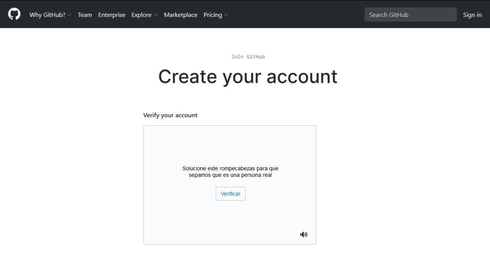
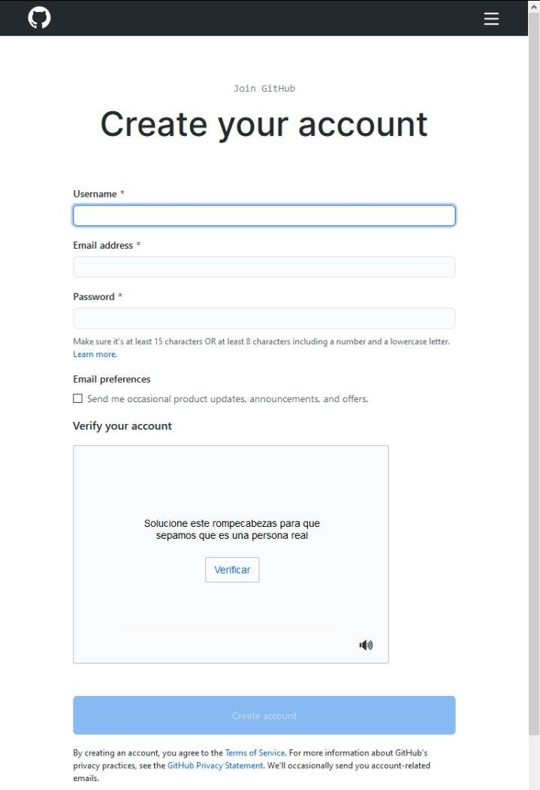
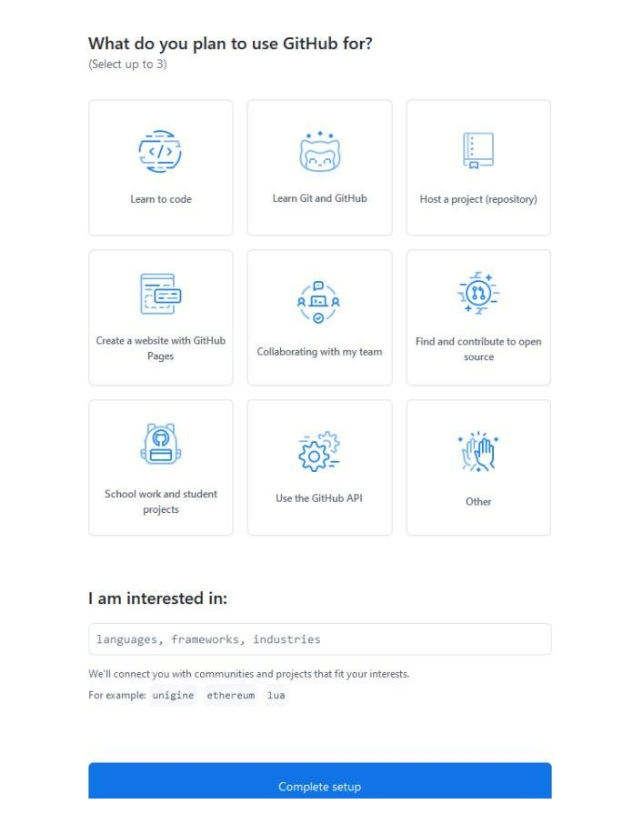
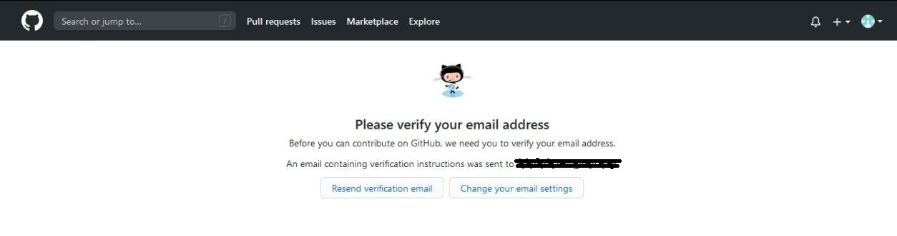
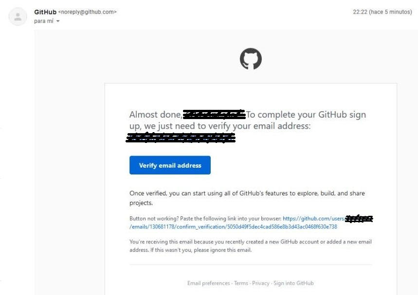

# Registrate en Github 

Para poder hacer pull request es necesario tener una cuenta en Github, para ello ve la página de [registro](https://github.com/join) y sigue los pasos.

**1.- Ingresas tus datos básicos.**

**2.- Verifica que no eres un robot :robot:.**

**3.- Presiona el botón de crear cuenta.**

**4.- Ajustas las configuraciones básicas.**

**5.- Revisa tu correo electrónico, y haz click el link que te llegó para verificar tu cuenta.**

**6.- ¡Felicidades, ya tienes cuenta en Github! :tada:**