# Contenido

- [Haciendo pull request en este repositorio](#make-pull-request)
- [Recomendaciones adicionales](#additional-recommendations)
  - [Creando develop_2](#creating-develop-2)
  - [Sincronizando tu fork](#syncing-your-fork)
  - [Sincronizando los archivos en tu computador](#syincing-local-files)
  - [Antes de hacer otro pull request](#before-creating-another-pull-request)

<a name="make-pull-request"/>

### Haciendo pull request en este repositorio

El proceso de hacer un pull request se puede resumir en los siguientes pasos:

- Hacer un fork de del repositorio en Github.
- Hacer un clone del fork en tu computador.
- Configurar tus datos básicos en el clone.
- Crear una rama desde la rama develop.
- Añadir en la carpeta correspondiente, los archivos que quieres enviar.
- Indicarle a git, cuales son los archivos que debe trackear.
- Guardar los cambios en git mediante un commit.
- Sincronizar el fork en Github con un push.
- Y, hacer el pull request al repositorio original desde Github.

A continuación, veremos a más a detalle como hacer cada uno de los pasos del proceso.

**Nota importante: Siempre debes hacer tu pull request contra la rama develop, nunca contra la rama master.**

Empiece haciendo un fork de este repositorio, para ello solo tienes que hacer click en el botón fork en la parte superior derecha.

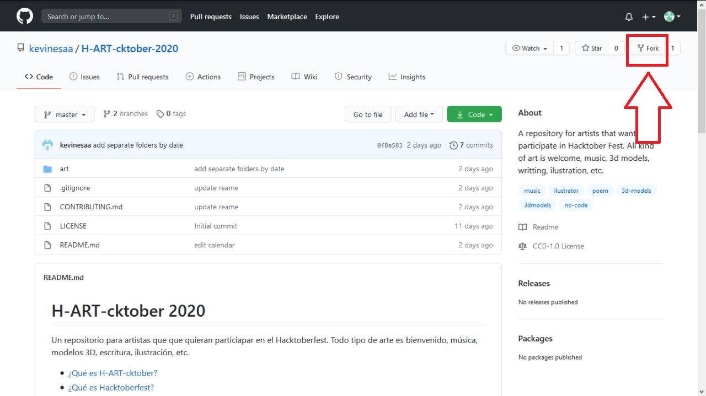

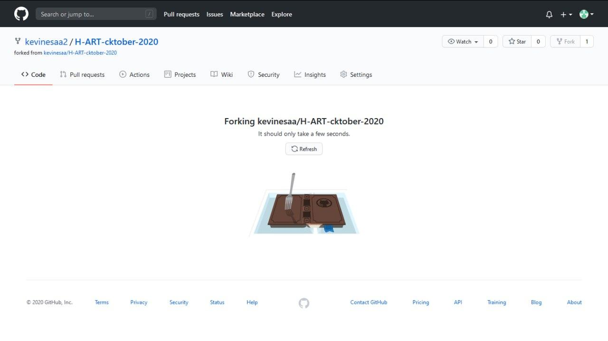

Para saber si estás viendo el fork o el repositorio original, fijate en
la esquina superior izquierda, el título del fork comienza con tu nombre
de usuario, seguido del nombre del repositorio; además incluye
el texto **forked from**, con el nombre de usuario y repositorio original.
 
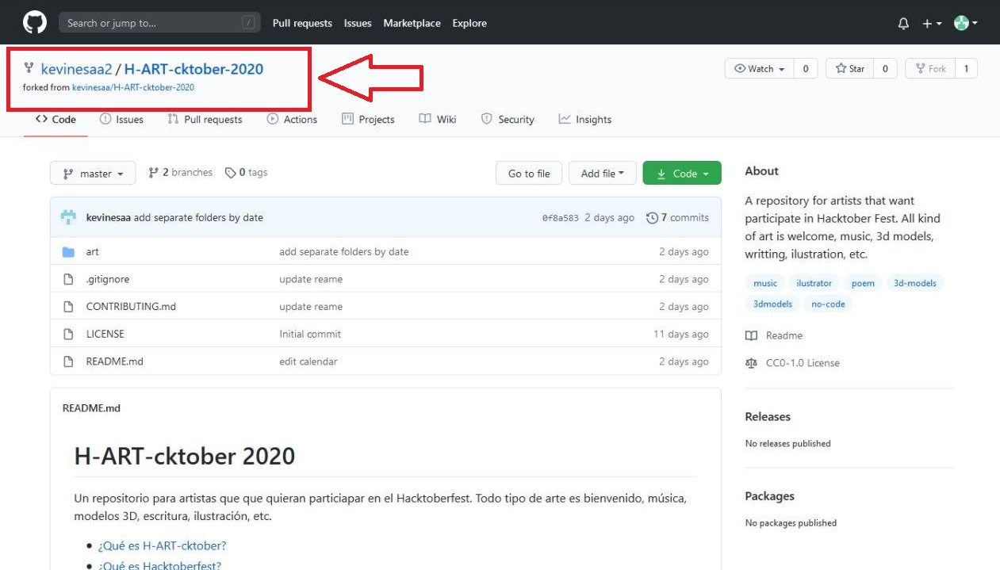

A continuación, haz click en el botón verde que dice **code** y copia la URL de la opción HTTPS.

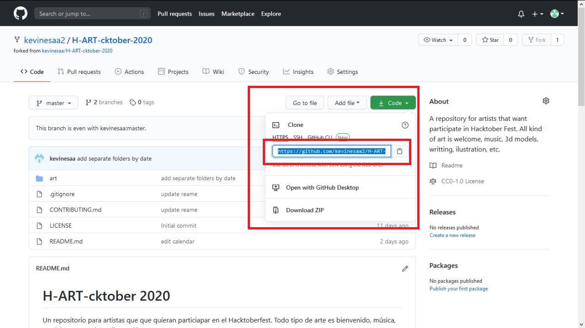

Crea una carpeta nueva en tu computador, y abre Git en ella.

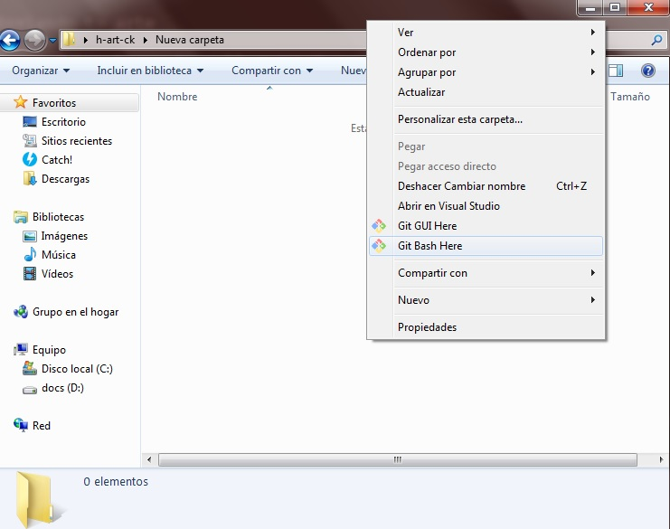

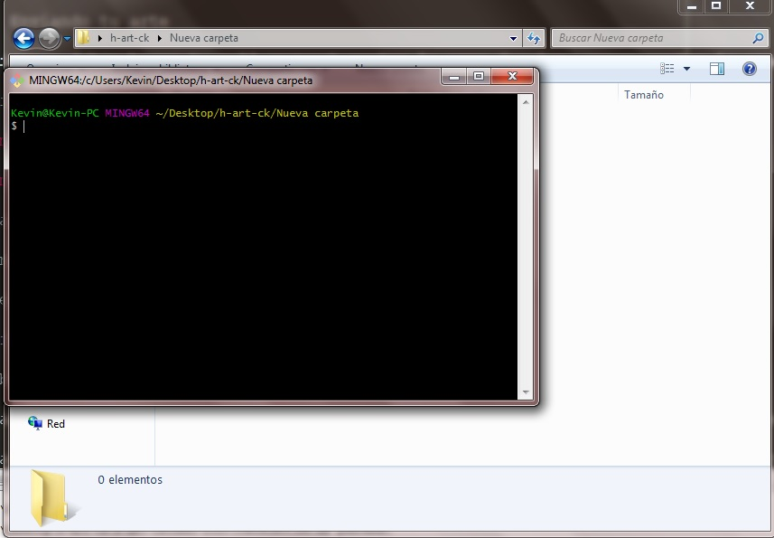

Lo siguiente es clonar el fork del repositorio en la carpeta que creaste. 
Para ello, en la consola de Git escribe lo siguiente:

`git clone fork_url` 

donde `fork_url` es la URL que copiaste antes; Y presiona enter.

Abre la consola de Git en la carpeta del repositorio que clonaste.

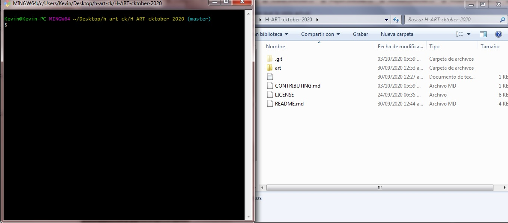

Configura Git con tus datos básicos. Primero añade tu dirección de correo eléctronico, escribiendo los siguiente:

`git -config --local user.email "mi_correo@dominio.com"` 

donde `mi_correo@dominio.com` es la dirección de correo eléctronico que usaste para registrarte en Github.
Luego añade tu nombre escribiendo lo siguiente:

`git -config --local user.name "Nombre y Apellido"`

**Nota: los pasos realizados hasta este punto, solo deben hacerse una vez.
Todo lo que sigue a partir de aquí, se debe hacer por cada pull request que hagas**

<a name="nuevo-pull"/>

Cambiate a la rama develop, escribiendo lo siguiente:

`git checkout develop`

Crea una nueva rama desde desde la rama develop. Nota: para efectos de ejemplo se usara el nombre *branch_name*.

`git branch branch_name`

Una vez termines de agregar alguna nueva funcionalidad, debes indicarle a Git que haga track de tus archivos, guardar los cambios en Git, y sincronizar los cambios en Github.

Para indicarle a Git que haga track de tus archivos, abre Git en la carpeta donde están los mismo y escribe lo siguiente: 

`git add .` 

y pulsar enter.

Para Guardar los cambios en Git, debes hacer un commit, para ello escribe lo siguiente:

`git commit -m "mensaje"` 

donde `mensaje` es una pequeña descripción de tu aporte.

Para sincronizar los cambios en Github, sólo hace falte hacer un push, para ello escribe lo siguiente:

`git push origin branch_name` 

Ahora sólo hace falta que hagas tu pull request al repositorio original.
Ve al fork del repositorio en Github, allí, busca y selecciona la rama que hiciste push anteriormente.

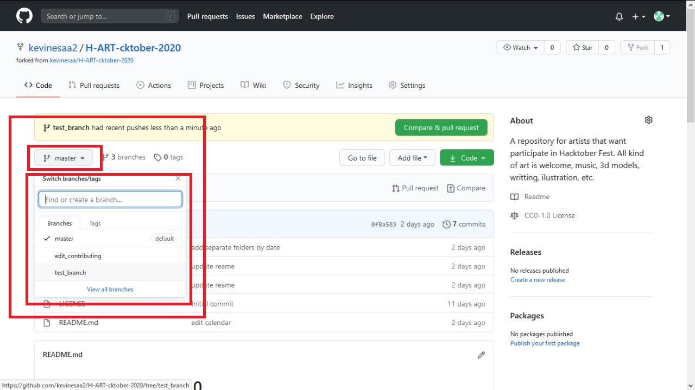

Luego, selecciona la opción **Pull requests**

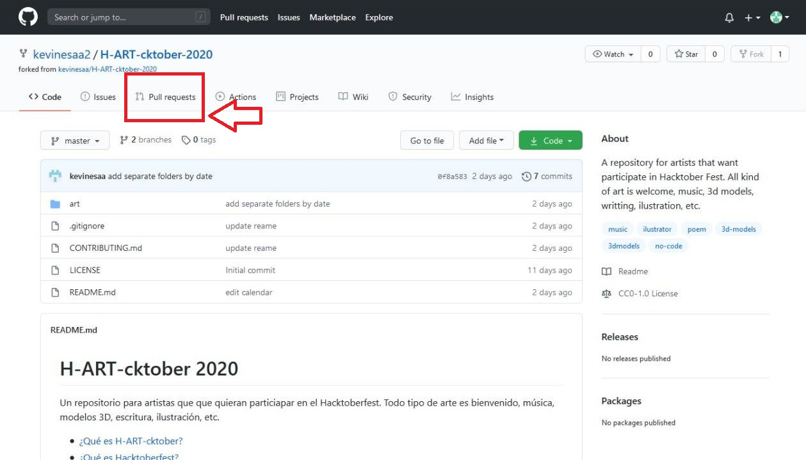

A continuación, pulsa el botón **new pull request**

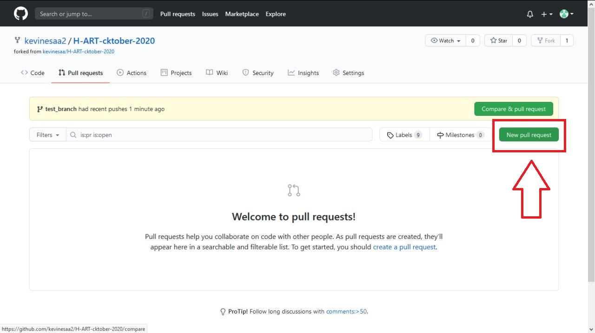

(1) Selecciona el repositorio al que hacer el pull request(comienza con el nombre del otro usuario),
(2) seguido de la rama a la que quieras hacer el pull request (para este repositorio siempre debes hacer pull request contra la rama develop);
(3) elige tu repositorio, al que previamente hiciste fork (comienza con tu nombre de usuario),
(4) y escoge la rama con la que quieres añadir cambios al repositorios principal, es decir, aquella que hiciste push anterioermente.
  
Luego, presiona el botón **create pull request**

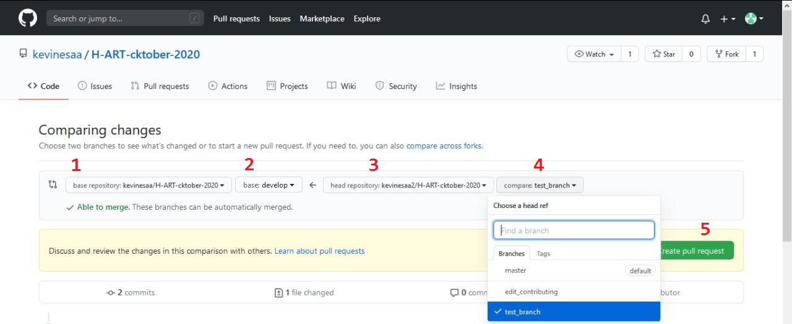

Debes agregar un título a tú pull request, y opcionalmente puedes añadir una descripción más detallada; Luego presiona el botón **Create pull request**

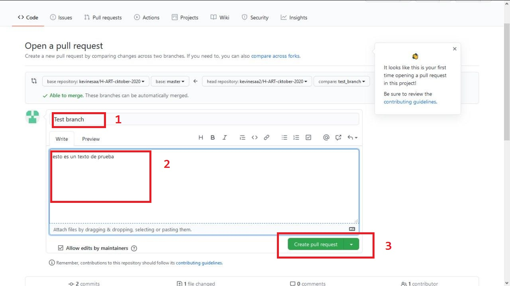

:tada: Si llegaste hasta aqui, es por que ya hiciste tu primer pull request ¡Felicidades! :tada:

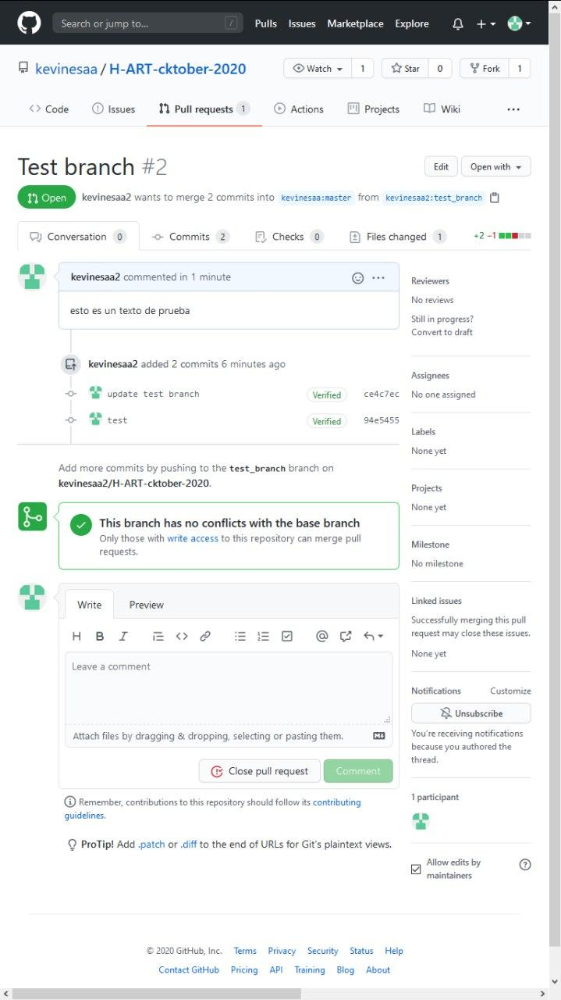

¿Quieres saber más acercade como se hace un Pull Request? Visita https://www.digitalocean.com/community/tutorials/how-to-create-a-pull-request-on-github

¿Quieres saber más acerca de git? Visita https://git-scm.com/book/es/v2

<a name="additional-recommendations"/>

# Recomendaciones adicionales

- [Creando develop_2](#creating-develop-2)
- [Sincronizando tu fork](#syncing-your-fork)
- [Sincronizando los archivos en tu computador](#syincing-local-files)
- [Antes de hacer otro pull request](#before-creating-another-pull-request)

<a name="creating-develop-2"/>

### Creando develop_2

La rama develop_2, es totalmente opcional y sirve para puedas tener todos
tus creaciones en una única rama, mientras esperas a que tu pull request
sea integrado al repositorio principal, y luego sincronizar tu fork y el repositorio en tu computador.
 
Abre una consola de Git en la carpeta principal del repositorio en tu computador. 
Luego, cambiate a la rama **develop** escribiendo lo siguiente:

`git checkout develop`

Ahora crea la rama *develop_2*, para ello escribe lo siguiente:

`git branch develop_2`

Para añadir los cambios de otra rama a la rama develop_2, primero debes cambiarte a la misma escribiendo:

`git checkout develop_2`

Y añadimos los cambios de la otra rama mediante un **merge**, de la siguiente forma:

`git merge branch_name`

Todos estos pasos puedes hacerlos después de cada pull request, para mantener todos tus archivos en una única rama.
Además, después de cada *merge* es recomendable borrar la rama que se ha integrado; para ello hacemos lo siguiente:

`git branch -D branch_name`

note que la bandera `-D` debe ser escrita en mayúscula.

Si lo desea, también puede añadir la rama *develop_2* a su fork en Github, escribiendo un push de la forma siguiente:

`git push origin develop_2`

Recuerda que para hacer un push, debes estar en la consola de Git con la
rama que quieres sincronizar en Github; asegurate de ello
haciendo `git checkout develop_2` antes.

También es recomendable que borres la rama de tus archivos en Github, luego hacer el pull request, para ello puedes escribir lo siguiente: 

`git push --delete origin branch_name`

<a name="syncing-your-fork"/>

### Sincronizando tu fork

Sincronizar un fork con el repositorio original, es similar a hacer un pull request. Primero, debes ir al fork en Github y buscar la opción pull request.

de igual forma, debes presionar el botón **New pull request**

Luego, (1) Selecciona el repositorio al que se va a hacer el pull request, en este caso seleccionaras tu repositorio, es decir aquel que comience con tu nombre de usuario.
(2) Después, debes seleccionar la rama que quieres sincronizar.
(3) elige el repositorio original, es decir, el que comienza con el nombre del otro usuario.
(4) y escoge la rama desde donde quieres sincronizar tu repositorio; es recomendable que la rama del paso (2) y del paso (4) sean las misma.

Y presiona el botón **Create pull request**

Nota: si al momento de seleccionar la rama en el paso (2) desapare la opción de elegir el repositorio del paso (3), haz click donde dice **compare across forks**.

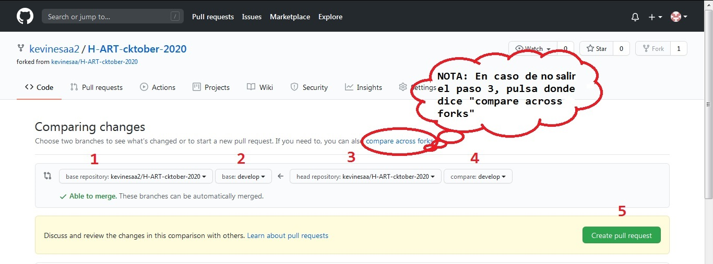

Aquí también, debes agregar un título a tú pull request, y opcionalmente puedes añadir una descripción más detallada; Luego presiona el botón **Create pull request**

Lo anterior, creará una entrada en la sección de pull request de tu fork, buscala y abrela.

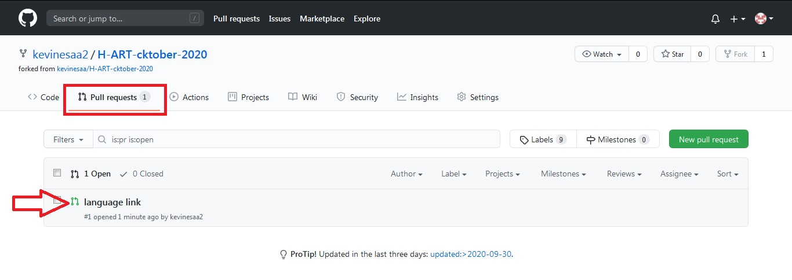

Ahora, sólo hace falta hacer el merge; Presiona el botón **Merge pull request**, y luego **Confirm merge**.

:tada: ¡Felicidades! si todo está bien ya tines sincronizado tu fork con el repositorio original :tada:

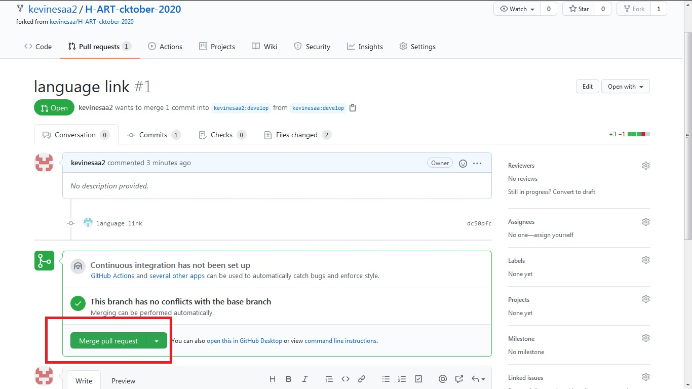

<a name="syincing-local-files"/>

### Sincronizando los archivos en tu computador

Abre una consola de Git en la carpeta principal del repositorio en tu computador. 
Luego, cambiate a la rama que quieres sincronizar (para este caso se usara la rama **develop**), 
para ello escribe lo siguiente:

`git checkout develop`

Posteriormente, actualizamos la rama de la siguiente forma: 

`git pull`

Y ya con eso tenemos sincronizados los archivos en nuestro computador, de la rama en cuestión.

<a name="before-creating-another-pull-request"/>

### Antes de hacer otro pull request

Asegurate de estar en la rama **develop** antes de empezar. Para ello puedes escribir en la consola de Git:

`git checkout develop` 

Si [actualizaste tu fork](#syncing-your-fork), también es recomendable que actualices tus archivos locales. Escribiendo `git pull` puedes asegurarte.

Si lo deseas, puedes borrar la rama donde trabajaste anteriormente, de la forma siguiente:

`git branch -D branch_name`

Opcionalmente, puedes borrar la rama en el fork, escribiendo: 

`git push --delete origin branch_name`

A partir de aquí, sólo tienes que repetir algunos pasos para hacer un
nuevo pull request, específicamente desde [aquí](#nuevo-pull)
